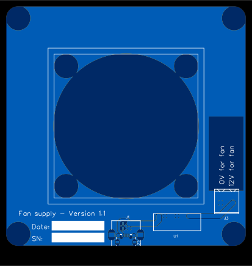
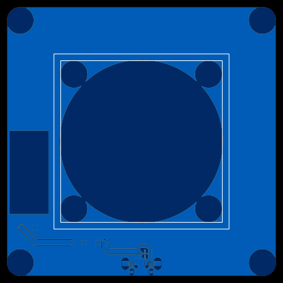

Fan supply
==========

A power supply and holder for a 60mm computer fan. The board is powered by a USB connector. 12 volts for the fan is created with a DC/DC boost converter using the USB's 5 volts.

| Top                                                | Bottom                                                   |
| -------------------------------------------------- | -------------------------------------------------------- |
|  |  |

TODO: Add photo

Licence
-------

Copyright © 2022 Phil Baldwin

This work is licensed under a Creative Commons Attribution-ShareAlike 4.0 International License.

You should have received a copy of the license along with this work. If not, see <http://creativecommons.org/licenses/by-sa/4.0/>.
