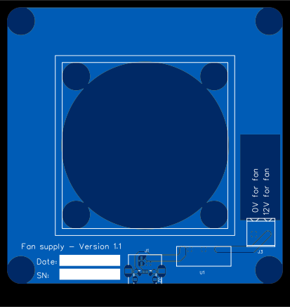
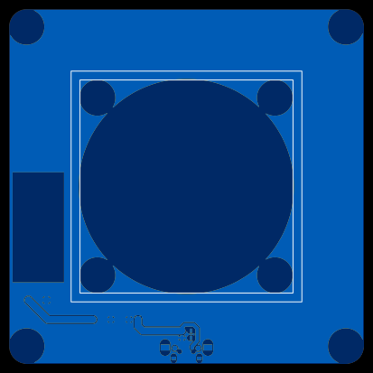

Fan supply
==========

A power supply and holder for a 60mm computer fan. The board is powered by a USB connector. 12 volts for the fan is created with a DC/DC boost converter using the USB's 5 volts.

Can be used with <https://github.com/PhilboBaggins/fan-pipe>

| Top                                                | Bottom                                                   |
| -------------------------------------------------- | -------------------------------------------------------- |
|  |  |

Demo
----

[fan-supply-with-fan-pipe.mp4](./fan-supply-with-fan-pipe.mp4) is a video of the "Fan Supply" board powering a computer fan with the [fan pipe](https://github.com/PhilboBaggins/fan-pipe) mounted on top.

<video controls loop>
    <source src="./fan-supply-with-fan-pipe.mp4" type="video/mp4">
    If you're seeing this then your browser does not support the video tag.
</video>

Licence
-------

Copyright © 2022 Phil Baldwin

This work is licensed under a Creative Commons Attribution-ShareAlike 4.0 International License.

You should have received a copy of the license along with this work. If not, see <http://creativecommons.org/licenses/by-sa/4.0/>.
